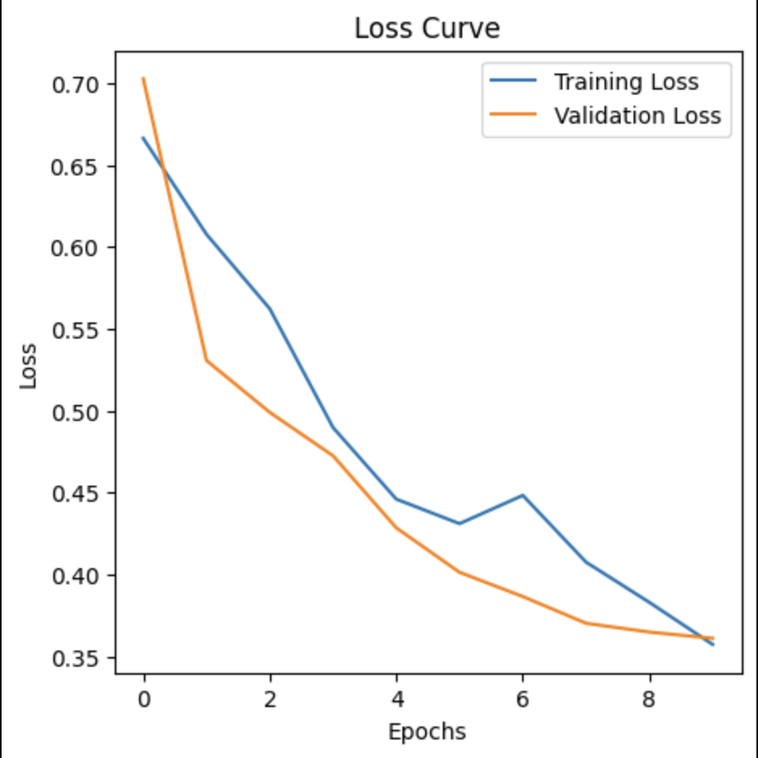
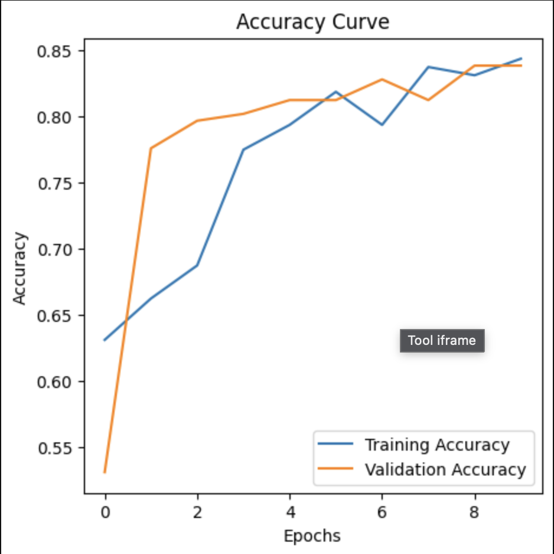
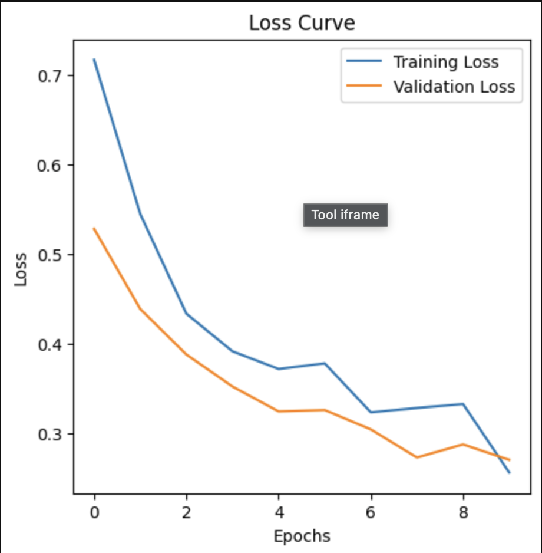
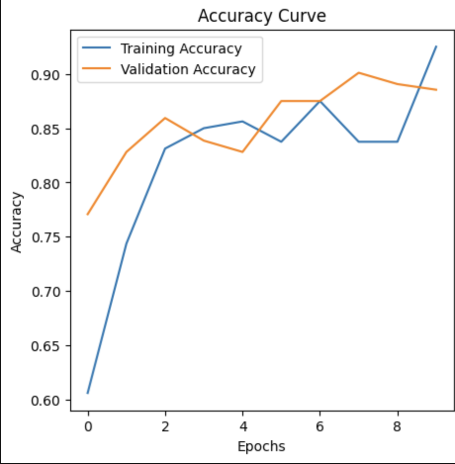

# ♻️ Waste Product Classification Using Transfer Learning and Fine-Tuning

A computer vision project that classifies waste products using deep learning. The project compares feature extraction (transfer learning) and fine-tuning approaches with a pretrained VGG16 model to evaluate their effectiveness for image classification.

---

## 📖 Project Overview

Efficient waste sorting is an important step toward improving recycling systems and reducing environmental impact. Manual sorting is often slow and prone to errors, making computer vision a promising solution for automated waste classification.

This project investigates two transfer learning strategies using the VGG16 architecture:

* **Transfer Learning (Feature Extraction)** – the pretrained convolutional layers remain frozen while only the classifier is trained.
* **Fine-Tuning** – selected pretrained layers are unfrozen and retrained to improve performance on the waste classification dataset.

The project compares both approaches using training curves and prediction results to better understand the impact of fine-tuning.

---

## 🎯 Objectives

* Build an image classifier for waste products.
* Apply transfer learning using a pretrained VGG16 network.
* Compare feature extraction and fine-tuning approaches.
* Evaluate model performance using accuracy and loss metrics.
* Visualize predictions on unseen images.

---

## 📂 Dataset

The dataset contains images of waste products grouped into two classes:

* Organic Waste
* Recyclable Waste

Images were resized and normalized before training using TensorFlow's `ImageDataGenerator`.

---

## 🧠 Model Architecture

The classification model uses:

* VGG16 (ImageNet Pretrained)
* Transfer Learning
* Fine-Tuning
* Fully Connected Dense Layers
* Dropout Regularization
* Binary Classification Output

---

## ⚙️ Methodology

### Data Preprocessing

* Image resizing
* Pixel normalization
* Data generation using `ImageDataGenerator`
* Train, validation, and test splits

### Transfer Learning

The pretrained VGG16 network was used as a feature extractor while keeping its convolutional layers frozen.

### Fine-Tuning

After initial training, selected pretrained layers were unfrozen and retrained to improve feature learning and model performance.

---

## 📊 Results

### Transfer Learning Loss



The training and validation loss curves illustrate how the feature extraction model learned throughout training.

---

### Transfer Learning Accuracy



Training and validation accuracy demonstrate the classification performance achieved using frozen VGG16 features.

---

### Fine-Tuning Loss



Fine-tuning reduced loss further by allowing selected pretrained layers to adapt to the waste classification dataset.

---

### Fine-Tuning Accuracy



Accuracy curves highlight the performance improvements obtained after fine-tuning the pretrained network.

---

## 🛠️ Technologies Used

| Technology   | Purpose                         |
| ------------ | ------------------------------- |
| Python       | Programming Language            |
| TensorFlow   | Deep Learning Framework         |
| Keras        | Model Development               |
| VGG16        | Transfer Learning               |
| NumPy        | Numerical Computing             |
| Matplotlib   | Visualization                   |
| Scikit-learn | Data Preprocessing & Evaluation |

---

## 📁 Repository Structure

```text
waste-product-classification/
│
├── README.md
├── requirements.txt
├── main.py
│
├── src/
│   ├── data_loader.py
│   ├── model.py
│   ├── training.py
│   ├── evaluation.py
│   └── visualization.py
│
├── images/
│   ├── transfer_learning_loss.png
│   ├── transfer_learning_accuracy.png
│   ├── fine_tuning_loss.png
│   ├── fine_tuning_accuracy.png
│   ├── transfer_learning_prediction.png
│   └── fine_tuning_prediction.png
│
└── models/
```

---

## 💡 Key Learnings

Through this project, I gained practical experience with:

* Transfer Learning
* Fine-Tuning Pretrained Networks
* Computer Vision
* Deep Learning Model Training
* Image Classification
* Performance Evaluation
* Model Comparison
* TensorFlow and Keras

---

## 🚀 Future Improvements

* Evaluate additional architectures such as ResNet50 and EfficientNet.
* Expand the dataset with more waste categories.
* Apply advanced data augmentation techniques.
* Deploy the classifier as a web application.
* Compare multiple transfer learning strategies.

---

## 👨‍💻 Author

**Samridhi Bhardwaj**

Originally developed as part of a deep learning project and later refactored into a structured portfolio project demonstrating transfer learning and fine-tuning techniques for image classification.
